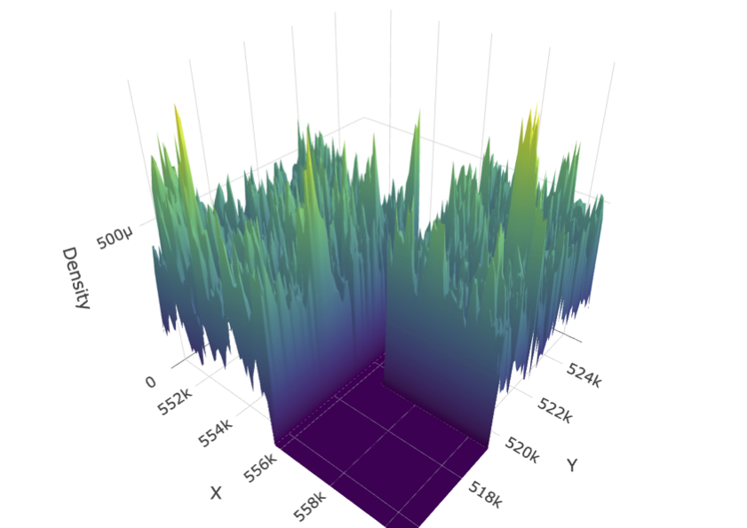

```{r}
#| include: false
knitr::opts_chunk$set(fig.width=7,fig.height=7,fig.align="center", dev="png",dpi=220,out.width="100%")
set.seed(42)
xlim<-c(-2,12)
ylim<-c(-2,12)
forest_xlim <- c(0,10)
forest_ylim <- c(0,10)
n_trees<-20
trees<-data.frame(x=runif(n_trees,-2,12),y=runif(n_trees,-2,12))
sample_point<-c(x=4.3,y=5.8)
r<-2.6
theta<-seq(0,2*pi,length.out=200)
selected<-sqrt((trees$x-sample_point["x"])^2+(trees$y-sample_point["y"])^2)<=r
draw_circle<-function(cx,cy,rad,...){
 lines(cx+rad*cos(theta),cy+rad*sin(theta),...)
}
```

## Sample unit is a point

:::: {.columns}
::: {.column width="58%"}
```{r}
par(mar=c(0,0,0,0))
plot(trees$x,trees$y,type="n",xlim=xlim,ylim=ylim,axes=FALSE,asp=1,xlab="",ylab="")
points(trees$x[!selected],trees$y[!selected],pch=17,col="gray60",cex=1.5)
points(trees$x[selected],trees$y[selected],pch=17,col="forestgreen",cex=1.5)
draw_circle(sample_point["x"],sample_point["y"],r,col="black",lwd=2)
points(sample_point["x"],sample_point["y"],pch=4,col="black",cex=2.2,lwd=3)
```
:::
::: {.column width="42%"}
\footnotesize
\begin{itemize}
    \item A circular plot is centered on the \textbf{sample point} selects trees inside the inclusion radius.
    \item[] 
    \item Multiple inclusion radii are possible based on DBH thresholds.
    \item[]
    \item There are infinite points in the forest.
    \item[]
    \item \textbf{Finite population sampling theory} is commonly used but the problem is poorly posed.
    \item[]
    \item Circles do not tesselate! Angle count sampling makes no sense...
\end{itemize}
:::
::::

## \textbf{Workaround:} Draw same inclusion rings around trees

:::: {.columns}
::: {.column width="58%"}
```{r}
par(mar=c(0,0,0,0))
plot(trees$x,trees$y,type="n",xlim=xlim,ylim=ylim,axes=FALSE,asp=1,xlab="",ylab="")
for(i in which(selected)){
 xx<-trees$x[i]+r*cos(theta)
 yy<-trees$y[i]+r*sin(theta)
 polygon(xx,yy,col=adjustcolor("forestgreen",alpha.f=.25),border=NA)
 lines(xx,yy,col="forestgreen",lwd=1.5,lty=2)
}
points(trees$x[!selected],trees$y[!selected],pch=17,col="gray60",cex=1.5)
points(trees$x[selected],trees$y[selected],pch=17,col="forestgreen",cex=1.5)
points(sample_point["x"],sample_point["y"],pch=4,col="black",cex=2.2,lwd=3)
```
:::
::: {.column width="42%"}
\footnotesize
\begin{definition}[Duality principle]
trees in radius around point same as point in radius around trees.
\end{definition}
\begin{itemize}
    \item[]
    \item Overlap of the inclusion rings illustrates density accumulation at a point.
    \item[]
    \item Sample unit is the point; not the trees.
    \item[]
\end{itemize}

$x$
: point at plot center

:::
::::

## Boundary adjustment on trees (not plots)

:::: {.columns}
::: {.column width="58%"}
```{r}
#| dev.args:
#|   bg: "transparent"
par(mar=c(0,0,0,0),xpd=NA)
plot(trees$x,trees$y,type="n",xlim=xlim,ylim=ylim,axes=FALSE,asp=1,xlab="",ylab="")
dist<-pmin(trees$x-xlim[1],xlim[2]-trees$x,trees$y-ylim[1],ylim[2]-trees$y)
sel<-which(selected); border_i<-sel[which.min(dist[sel])]
points(trees$x[-border_i],trees$y[-border_i],pch=17,col="gray60",cex=1.5)
points(trees$x[border_i],trees$y[border_i],pch=17,col="forestgreen",cex=1.5)
usr<-par("usr"); shade<-adjustcolor("grey93",alpha.f=.45)
rect(usr[1],usr[3],forest_xlim[1],usr[4],col=shade,border=NA)
rect(forest_xlim[2],usr[3],usr[2],usr[4],col=shade,border=NA)
rect(forest_xlim[1],usr[3],forest_xlim[2],forest_ylim[1],col=shade,border=NA)
rect(forest_xlim[1],forest_ylim[2],forest_xlim[2],usr[4],col=shade,border=NA)
rect(forest_xlim[1],forest_ylim[1],forest_xlim[2],forest_ylim[2],border="black",lwd=2)
xx<-trees$x[border_i]+r*cos(theta)
yy<-trees$y[border_i]+r*sin(theta)
clip(forest_xlim[1],forest_xlim[2],forest_ylim[1],forest_ylim[2])
polygon(xx,yy,col=adjustcolor("forestgreen",alpha.f=.25),border=NA)
do.call("clip",as.list(usr))
lines(xx,yy,col="forestgreen",lwd=2,lty=2)
points(trees$x[border_i],trees$y[border_i],pch=17,bg="white",col="forestgreen",cex=1.5,lwd=2)
```
:::
::: {.column width="42%"}
\footnotesize
- Plots with centers outside forest (gray) are **not visited** for budget reasons.

- Requires boundary adjustment for **trees**.

\begin{definition}[Indicator variable]
\[
  I_i(x)=
  \begin{cases}
  1,&\text{if }x\in K_i,\\
  0,&\text{if }x\notin K_i.
  \end{cases}
\]
\end{definition}

\begin{definition}[Inclusion probability]
\[
  \pi_i = \mathbb{P}[I_i(x)] = \mathbb{E}[I_i(x)] =
  \frac{A_{K_i}}{A_T}
\]
\end{definition}

$K_i$
: inclusion ring around tree $i$

$A_T$ ; $A_{K_i}$
: area of $T$ ; $K_i$ (bnd. adjusted)

$T$
: territory of interest
:::
::::

## Local density surface from above

:::: {.columns}
::: {.column width="58%"}
```{r}
#| dev.args:
#|   bg: "transparent"
par(mar=c(0,0,0,0),xpd=NA)
plot(trees$x,trees$y,type="n",xlim=xlim,ylim=ylim,axes=FALSE,asp=1,xlab="",ylab="")
in_box <- (trees$x >= forest_xlim[1] & trees$x <= forest_xlim[2]) & (trees$y >= forest_ylim[1] & trees$y <= forest_ylim[2])
dist<-pmin(trees$x-xlim[1],xlim[2]-trees$x,trees$y-ylim[1],ylim[2]-trees$y)
sel<-which(selected); border_i<-sel[which.min(dist[sel])]
points(trees$x[!selected],trees$y[!selected],pch=17,col="gray60",cex=1.5)
points(trees$x[in_box],trees$y[in_box],pch=17,col="black",cex=1.5)
usr<-par("usr"); shade<-adjustcolor("grey93",alpha.f=.45)
rect(usr[1],usr[3],forest_xlim[1],usr[4],col=shade,border=NA)
rect(forest_xlim[2],usr[3],usr[2],usr[4],col=shade,border=NA)
rect(forest_xlim[1],usr[3],forest_xlim[2],forest_ylim[1],col=shade,border=NA)
rect(forest_xlim[1],forest_ylim[2],forest_xlim[2],usr[4],col=shade,border=NA)
rect(forest_xlim[1],forest_ylim[1],forest_xlim[2],forest_ylim[2],border="black",lwd=2)

for(i in which(in_box)){
xx<-trees$x[i]+r*cos(theta)
yy<-trees$y[i]+r*sin(theta)
clip(forest_xlim[1],forest_xlim[2],forest_ylim[1],forest_ylim[2])
polygon(xx,yy,col=adjustcolor("forestgreen",alpha.f=.25),border=NA)
do.call("clip",as.list(usr))
points(trees$x[in_box],trees$y[in_box],pch=17,bg="white",col="forestgreen",cex=1.5,lwd=2)  
}

for(i in which(in_box)){
xx<-trees$x[i]+r*cos(theta)
yy<-trees$y[i]+r*sin(theta)
clip(forest_xlim[1],forest_xlim[2],forest_ylim[1],forest_ylim[2])
# polygon(xx,yy,col=adjustcolor("forestgreen",alpha.f=.25),border=NA)
do.call("clip",as.list(usr))
lines(xx,yy,col="forestgreen",lwd=2,lty=2)
}
points(sample_point["x"],sample_point["y"],pch=4,col="black",cex=2.2,lwd=3)
```
:::
::: {.column width="42%"}
\footnotesize
\centering
\textbf{\underline{Surface is fixed; point is random}}
\begin{definition}[Local density surface]

\[
Y(x)=\frac{1}{A_T}\sum_{i=1}^N\frac{I_i(x)Y_i}{\pi_i}
\]

\end{definition}

$Y_i$
: measurement for tree $i$

$\pi_i$
: inclusion probability for tree $i$

$N$
: number of trees in territory $T$

$I_i(x)$
: indicator that tree $i$ is selected at $x$

$A_T$
: surface area of $T$


\begin{block}{Interpretation}

$Y(x)$ is the Horvitz--Thompson estimator (for the spatial) mean with sample size one.

\end{block}
:::
::::

## Monte Carlo integration --- a reminder
:::: {.columns}
::: {.column width="60%"}
\vspace{0cm}
```{r}
#| dev.args:
#|   bg: "transparent"
#| fig.height: 4.3
#| fig.width: 4.65
par(mar=c(2.2, 0.5, 0, 0.5))
f <- function(x) 1 + 2*sin(x/2)*exp(-x/6)
xs <- seq(0, 10, length.out = 300)
ys <- f(xs)
ymax <- ceiling(max(ys) * 1.15)
plot(xs, ys, type="n", xlim=c(0,10), ylim=c(0,ymax),
     axes=FALSE, xlab="", ylab="")
# smooth curve
lines(xs, ys, lwd=3, col="forestgreen")
text(9.3, f(9.3)+0.6, expression(f(x)), col="forestgreen", cex=1.4)
# x-axis and domain
abline(h=0, lwd=1.5)
axis(1, at=c(0.5,9.5), labels=c(expression(a), expression(b)), lwd=0)
# sampled points on the x-axis
set.seed(7)
n <- 12
xr <- sort(runif(n, 0.5, 9.5))
# dashed verticals up to the curve, showing f(x_i)
segments(xr, 0, xr, f(xr), lty=2, col="grey50")
segments(c(0.5,9.5), 0, c(0.5,9.5), f(c(0.5,9.5)), lty=1, col="black", lwd = 2)
points(xr, f(xr), pch=19, col="forestgreen", cex=1.1)
# red dots ON the x-axis = the sample
points(xr, rep(0, n), pch=19, col="red", cex=1.3)
text(mean(xr), -ymax*0.06, expression(x[i]*" ~ Unif(a,b)"), col="red", cex=1.1, xpd=NA)
```
:::
::: {.column width="40%"}
\vspace{0.6cm}
\footnotesize
\textbf{Steps}
\begin{enumerate}
\setlength{\itemsep}{4pt}
\item Draw $x_1,\dots,x_n$ uniform \& independent on $[a,b]$
\item Evaluate $f(x_i)$
\item Average: $\bar f = \frac{1}{n}\sum_i f(x_i)$
\item Scale by domain length:
\[
\int_a^b f(x)\,dx \approx (b-a)\bar f
\]
\end{enumerate}
\vspace{4pt}
\footnotesize
\textbf{Law of Large Numbers} \newline $\bar f \to \mathbb{E}[f(x)]$) \newline\newline
\textbf{Central Limit Theorem} \newline $\sqrt{n}(\bar f - \mathbb{E}[f(x)]) \xrightarrow{d} \mathcal{N}(0,\sigma^2)$ \textcolor{gray}{(for CIs)}
:::
::::

## Exercise --- Prove equivalence of sampling trees and Monte Carlo integration

\footnotesize
\centering
\begin{block}{Show (assume uniform independent sampling)}
\[
A_T \cdot \mathbb{E}[Y(x)] \;=\; \int_T Y(x)\,dx \;=\; \sum_{i=1}^{N} Y_i
\]
\vspace{0.25em}
\flushright \textcolor{gray}{\textbf{Hint :}  $\mathbb{E}[g(X)] = \int g(x)\,f(x)\,dx
\qquad\text{and}\qquad
\mathbb{E}[I_i(x)] = \pi_i$}
\end{block}
\pause
\begin{proof}
\begin{align}
\onslide<2->{A_T \cdot \mathbb{E}[Y(x)]
  &= A_T \cdot \int_T Y(x)\,\underbrace{\frac{1}{A_T}}_{f(x)}\,dx
   =\int_T Y(x)\,dx} \\
\onslide<3->{A_T \cdot \mathbb{E}[Y(x)]
  &=  A_T \cdot \mathbb{E}\!\left[\frac{1}{A_T}\sum_{i=1}^N \frac{I_i(x)\,Y_i}{\pi_i}\right]
   = \sum_{i=1}^N \frac{Y_i}{\pi_i}\,\mathbb{E}[I_i(x)] = \sum_{i=1}^N \frac{Y_i}{\pi_i}\cdot \pi_i
   = \sum_{i=1}^N Y_i}
\end{align}
\end{proof}

## View of 3d local density surface from artificial forest
Not so useful...  It is easier to simplify the dimension.
\centering
{width=60%}


## Heuristic representation of Monte Carlo approach

```{r}
#| include: false
#| fig.height: 5
#| fig.width: 10
library(ggplot2)
library(dplyr)
library(patchwork)
library(ggbrace)

set.seed(4)
lambda_F <- 40
n_trees <- 15
range <- 3
tree_x <- lambda_F * rbeta(n_trees, 0.5, 0.9)
tree_height <- n_trees * abs(rbeta(length(tree_x), 2, 3))
sampling_radius <- rep(range, n_trees)

trees <- data.frame(loc = tree_x, ground = 0, height = tree_height,
                    kmin = pmax(0, tree_x - sampling_radius),
                    kmax = pmin(lambda_F, tree_x + sampling_radius),
                    y = -0.2 - 1.5 * sample(1:length(tree_x)) / length(tree_x)) |>
  mutate(extrap_factor = 1 / (kmax - kmin),
         density = height * extrap_factor)

moving_sum_outer <- function(x, x_0, y_0, range = 2) {
  mat <- abs(outer(x, x_0, "-")) <= range
  rowSums(t(t(mat) * y_0))
}

local_density <- data.frame(x = seq(0, lambda_F, by = 0.01)) |>
  mutate(y = moving_sum_outer(x = x, x_0 = trees$loc, y_0 = trees$density, range = range))

density_max <- max(local_density$y)
tree_height_max <- max(trees$height)
scale_factor <- tree_height_max / density_max
local_density <- local_density |> mutate(y_scaled = y * scale_factor)

sampled_x <- sort(runif(12, min = 0, max = lambda_F))
sampled_density <- approx(local_density$x, local_density$y_scaled, xout = sampled_x)$y
sampled_plots <- data.frame(x = sampled_x, y = sampled_density)

p1 <- ggplot() +
  geom_segment(data = trees, aes(x = loc, y = ground, xend = loc, yend = height),
               arrow = arrow(length = unit(0.2, "inches")), linewidth = 1.5, color = "forestgreen") +
  geom_segment(data = trees, aes(x = loc, y = ground, xend = loc, yend = 0.6 * height),
               arrow = arrow(length = unit(0.3, "inches")), linewidth = 2, color = "forestgreen") +
  annotate("text", x = 20, y = -1, label = expression(A[T]),
           hjust = 0.5, vjust = 0.5, size = 5.5, color = "black") +
  stat_brace(aes(x=c(0,lambda_F), y=c(0.5,1.2)), inherit.aes = F, rotate=180) +
  geom_segment(aes(x = 0, xend = lambda_F, y = 0, yend = 0), linewidth = 1.5) +
  ylim(min(trees$y), max(trees$height)) +
  theme_void() +
  labs(title = "Trees in T") +
  theme(plot.title = element_text(vjust=-4, hjust=0.5, size=20, margin=margin(b=2)),
        plot.margin = margin(t=0,r=10,b=10,l=10),
        legend.position = "top", legend.direction = "horizontal", legend.text = element_text(size=16))

p2 <- ggplot() +
  geom_segment(data = trees, aes(x = loc, y = 0.6*height, xend = loc, yend = height),
               arrow = arrow(length = unit(0.2,"inches")), linewidth = 1.5, color = "forestgreen") +
  geom_segment(data = trees, aes(x = loc, y = ground, xend = loc, yend = 0.6*height),
               arrow = arrow(length = unit(0.3,"inches")), linewidth = 2, color = "forestgreen") +
  geom_segment(data = trees, aes(x = kmin, y = -0.1, xend = kmax, yend = -0.1),
               linewidth = 3, color = "red", alpha = 0.3) +
  geom_segment(data = trees, aes(x = kmin, y = y, xend = kmax, yend = y),
               color = "red", linewidth = 0.7, alpha = 0.3, show.legend = FALSE) +
  geom_ribbon(data = local_density, aes(x = x, ymin = 0, ymax = y_scaled), fill = "pink", alpha = 0.92) +
  geom_line(data = local_density, aes(x = x, y = y_scaled, color = "Y(x)"), linewidth = 1.5) +
  geom_segment(aes(x = 0, xend = lambda_F, y = 0, yend = 0), linewidth = 1.5) +
  scale_color_manual(name = "", values = c("Y(x)" = "red"), labels = c(expression(Y(x)))) +
  guides(color = guide_legend(override.aes = list(size = 15))) +
  theme_void() +
  labs(title = "Local Density Surface") +
  theme(plot.title = element_text(vjust=-4, hjust=0.5, size=20, margin=margin(b=2)),
        plot.margin = margin(t=0,r=10,b=10,l=10),
        legend.position = "top", legend.direction = "horizontal", legend.text = element_text(size=16))

p3 <- ggplot() +
  geom_ribbon(data = local_density, aes(x = x, ymin = 0, ymax = y_scaled), fill = "gray", alpha = 1) +
  geom_segment(data = sampled_plots, aes(x = x, y = 0, xend = x, yend = y), color = "black", linewidth = 1) +
  geom_segment(aes(x = 0, xend = lambda_F, y = 0, yend = 0), linewidth = 1.5) +
  ylim(min(trees$y), max(trees$height)) +
  geom_point(data = sampled_plots, aes(x = x, y = 0), shape = 4, size = 3, color = "black", stroke = 1.5) +
  geom_point(data = sampled_plots, aes(x = x, y = y), shape = 20, size = 3, color = "red", stroke = 1.5) +
  labs(title = "Monte Carlo Integration", subtitle = "(uniform i.i.d)") +
  theme_void() +
  theme(plot.title = element_text(vjust=-4, hjust=0.5, size=20, margin=margin(b=2)),
        plot.subtitle = element_text(vjust=-4, hjust=0.5, size=16, margin=margin(t=2,b=2)),
        plot.margin = margin(t=0,r=10,b=10,l=10))

sampled_x_riemann_mid <- seq(0+(lambda_F/(2*12)), lambda_F, by = lambda_F/12)
sampled_x_riemann <- sampled_x_riemann_mid + runif(12, -(lambda_F/(2*12)), (lambda_F/(2*12)))
sampled_density_riemann <- approx(local_density$x, local_density$y_scaled, xout = sampled_x_riemann)$y
sampled_plots_riemann <- data.frame(x = sampled_x_riemann, y = sampled_density_riemann)
sampled_plots_riemann_mid <- data.frame(x = sampled_x_riemann_mid, y = sampled_density_riemann)
rect_width <- diff(sampled_plots_riemann_mid$x)[1]
rects <- sampled_plots_riemann_mid
rects$xmin <- rects$x - rect_width/2
rects$xmax <- rects$x + rect_width/2
rects$ymin <- 0
rects$ymax <- rects$y

p_rect <- ggplot() +
  geom_ribbon(data = local_density, aes(x = x, ymin = 0, ymax = y_scaled), fill = "gray", alpha = 1) +
  geom_segment(aes(x = 0, xend = lambda_F, y = 0, yend = 0), linewidth = 1.5) +
  ylim(min(trees$y), max(trees$height)) +
  geom_rect(data = rects, aes(xmin=xmin, xmax=xmax, ymin=ymin, ymax=ymax), fill=NA, alpha=0.8, color="black") +
  geom_point(data = sampled_plots_riemann, aes(x=x, y=0), shape=4, size=3, color="black", stroke=1.5) +
  geom_point(data = sampled_plots_riemann, aes(x=x, y=y), shape=20, size=3, color="red", stroke=1.5) +
  labs(title = "Riemann Integration*", subtitle = "(systematic sample)",
       caption = "*no design-unbiased variance estimator, but better convergence") +
  theme_void() +
  theme(plot.title = element_text(vjust=-4, hjust=0.5, size=20, margin=margin(b=2)),
        plot.subtitle = element_text(vjust=-4, hjust=0.5, size=16, margin=margin(t=2,b=2)),
        plot.caption = element_text(hjust = 0.5, size = 12.5, margin = margin(t = 1)),
        plot.margin = margin(t=0,r=10,b=8,l=10))

ggsave("fig_build1.png", p1 + p2 + p3 + plot_layout(ncol = 3), width = 10, height = 5, bg = "transparent", dpi = 200)
ggsave("fig_build2.png", p3 + p_rect + plot_layout(ncol = 2), width = 10, height = 5, bg = "transparent", dpi = 200)
```

\centering
\only<1>{\includegraphics[width=\textwidth]{fig_build1.png}}
\only<2>{\includegraphics[width=\textwidth]{fig_build2.png}}

## One-phase estimation for uniform independent sampling

\footnotesize
\centering

\begin{block}{Population parameters and their sample-copy estimators}
Assume $A_T$ is known.
\vspace{4pt}

\begin{tabular}{l r c l @{\hspace{3em}} r c l}
\textbf{Population} &
  $\mathbb{E}[Y(x)]$ & $=$ & $\dfrac{1}{A_T}\displaystyle\int_T Y(x)\,dx$ &
  $\mathbb{V}[Y(x)]$ & $=$ & $\dfrac{1}{A_T}\displaystyle\int_T \big(Y(x)-\mathbb{E}[Y(x)]\big)^2 dx$ \\[10pt]
\textbf{\textit{"Sample copy"}} &
  $\bar Y_s$ & $=$ & $\dfrac{1}{n}\displaystyle\sum_{x \in s} Y(x)$ &
  $\hat{\mathbb{V}}[Y(x)]$ & $=$ & $\dfrac{1}{n-1}\displaystyle\sum_{x \in s}\big(Y(x)-\bar Y_s\big)^2$ \\
\end{tabular}
\end{block}

\pause

\begin{definition}[One-phase point and variance estimator]
Draw $x \in s$, $n$ times, uniformly and independently.
\vspace{4pt}

\[
\hat Y_{1p} \;=\; \frac{1}{n}\sum_{x \in s} Y(x)
\quad\quad\quad
\mathbb{V}[\hat Y_{1p}]=\frac{\mathbb{V}[Y(x)]}{n}
\quad\quad\quad
\hat{\mathbb{V}}[\hat Y_{1p}]=\frac{\hat{\mathbb{V}}[Y(x)]}{n}
\]
\end{definition}

Every point estimator has a population variance estimated by a (sample) variance estimator.


## Short view of the classical survey sampling theory (Cordy, 1993)

\footnotesize

- For fixed sample size $n$, denote the sample $s = \{x_1, x_2, \dots, x_n\} \subset T$.
- Under \textbf{uniform i.i.d.} sampling, every $x_k$ has the same marginal density $f(x) = 1/A_T$.
- The **sampling intensity** (inclusion prob. from finite theory) is
$$
\pi(x) = \sum_{k=1}^n f(x) = n\,f(x) = \frac{n}{A_T}, \qquad x \in T
$$
- The **second-order sampling intensity** (probability of a pair being jointly sampled) is
$$
\pi(x,x') = \sum_{k=1}^n\sum_{j\neq k} f(x)f(x') = n(n-1)\,f(x)f(x') = \frac{n(n-1)}{A_T^2}, \qquad x \neq x'
$$

\pause

\begin{block}{Note}
General survey sampling allows $f_k(x)$ to vary by draw or be non-uniform (importance sampling, unequal probability designs). Under uniform i.i.d.\ sampling both intensities collapse to constants --- they don't depend on $x$ at all.
\end{block}

## Horvitz--Thompson estimator and Yates--Grundy variance

\footnotesize

\begin{block}{General form}
\[
\hat Y = \sum_{x \in s} w(x)\,Y(x)
\]
The \textbf{Horvitz--Thompson estimator} sets $w(x) = 1/\pi(x)$ and is design-unbiased whenever $\pi(x) > 0$ for all $x \in T$.
\end{block}

\pause

\begin{block}{Yates--Grundy variance estimator}
Unbiased under regularity conditions (most notably fixed $n$ and $\pi(x,x') > 0$):
\[
\hat{\mathbb{V}}(\hat Y_\pi) = -\frac{1}{2}\sum_{x \in s}\sum_{x' \neq x} \frac{\pi(x,x') - \pi(x)\pi(x')}{\pi(x,x')} \left(\frac{Y(x)}{\pi(x)} - \frac{Y(x')}{\pi(x')}\right)^2
\]
\end{block}

## Several minutes later...

\begin{block}{Plug in uniform i.i.d.\ intensities}
With $\pi(x) = n/A_T$ and $\pi(x,x') = n(n-1)/A_T^2$, tedious algebra recovers exactly what we already had from Monte Carlo integration:
\[
\hat Y_\pi = A_T \cdot \hat Y_{1p} = A_T \cdot \frac{1}{n}\sum_{x \in s} Y(x)
\qquad\qquad
\hat{\mathbb{V}}(\hat Y_\pi) = \hat{\mathbb{V}}[\hat Y_{1p}] = \frac{\hat{\mathbb{V}}[Y(x)]}{n}
\]
\end{block}

\pause

\begin{block}{Why bother?}
This is how most people construct their understanding for forest inventory sampling (although usually for finite population theory). 

---

The \textbf{Monte Carlo approach} lets you more easily visualize, build intuition and derive a surprising number of valuable estimators.
\end{block}

## Model-assisted estimation under the Monte Carlo approach

```{r}
#| echo: false
#| dev.args:
#|   bg: "transparent"
#| fig.height: 5
#| fig.width: 12
library(data.table)
library(ggh4x)

# Moving max function with smoother to simulate canopy height model
moving_max <- function(data, x, y, window = 3, kernel = "flat") {
  dt <- as.data.table(data)
  x_vals <- dt[[x]]
  y_vals <- dt[[y]]

  dt[, y_max := sapply(x_vals, function(xi) {
    idx <- abs(x_vals - xi) <= window
    if (!any(idx)) return(NA_real_)

    if (kernel == "flat") {
      return(max(y_vals[idx], na.rm = TRUE))
    } else if (kernel == "triangle") {
      weights <- 1 - abs(x_vals[idx] - xi) / window
      weighted_values <- y_vals[idx] * weights
      return(max(weighted_values, na.rm = TRUE))
    } else if (kernel == "gaussian") {
      weights <- exp(-((x_vals[idx] - xi)^2) / (2 * window^2))
      weighted_values <- y_vals[idx] * weights
      return(max(weighted_values, na.rm = TRUE))
    } else {
      stop("Invalid kernel type. Choose 'flat', 'triangle', or 'gaussian'.")
    }
  })]

  return(dt)
}

# Dummy locations with 0 height to fill in forest extent
CHM <- data.table(loc = seq(0, lambda_F, by = 0.01),
                   ground = NA, height = 0, kmin = NA, kmax = NA,
                   y = NA, extrap_factor = NA, density = NA) |>
  rbind(trees |> as.data.table()) |>
  moving_max(x = "loc", y = "height", kernel = "gaussian", window = 2.2)

p4 <- ggplot() +
  geom_segment(data = trees, aes(x = loc, y = 0.6 * height, xend = loc, yend = height),
               arrow = arrow(length = unit(0.2, "inches")), linewidth = 1.5, color = "forestgreen", alpha = 0.5) +
  geom_segment(data = trees, aes(x = loc, y = ground, xend = loc, yend = 0.6 * height),
               arrow = arrow(length = unit(0.3, "inches")), linewidth = 2, color = "forestgreen", alpha = 0.5) +
  geom_segment(aes(x = 0, xend = lambda_F, y = 0, yend = 0), linewidth = 2) +
  geom_line(data = CHM, aes(x = loc, y = y_max, linetype = "Z(x)"), linewidth = 1, color = "blue") +
  scale_linetype_manual(name = "", values = c("Z(x)" = "longdash")) +
  ylim(min(trees$y), max(trees$height)) +
  ggtitle("Auxiliary Variable \n (e.g. CHM)") +
  theme_void() +
  theme(plot.title = element_text(hjust = 0.5, size = 20),
        legend.position = c(0.5, 0.1),
        legend.text = element_text(size = 18),
        legend.key.size = unit(1.2, "cm"),
        plot.margin = margin(t = 5, r = 10, b = 10, l = 10))

sampled_plots$y_max <- approx(CHM$loc, CHM$y_max, xout = sampled_plots$x)$y
local_density$y_max <- approx(CHM$loc, CHM$y_max, xout = local_density$x)$y

fit <- lm(y ~ y_max, data = local_density)
CHM$Y_hat <- predict(fit, newdata = CHM)
local_density$Y_hat <- predict(fit)
local_density$diff <- abs(residuals(fit))
sampled_plots$Y_hat <- approx(CHM$loc, CHM$Y_hat, xout = sampled_plots$x)$y

p5 <- ggplot() +
  geom_line(data = local_density, aes(x = x, y = y_scaled), color = "red", linewidth = 1) +
  geom_ribbon(data = local_density, aes(x = x, ymin = 0, ymax = Y_hat*scale_factor), fill = "blue", alpha = 0.5) +
  geom_line(data = local_density, aes(x = x, y = Y_hat*scale_factor, linetype = "Y_hat"), color = "blue", linewidth = 1.5) +
  scale_linetype_manual(name = "", values = c("Y_hat" = "solid"),
                         labels = expression(hat(Y)(x) == Z(x)^t~beta)) +
  geom_segment(aes(x = 0, xend = lambda_F, y = 0, yend = 0), linewidth = 1.5) +
  ylim(min(trees$y), max(trees$height)) +
  ggtitle("Predicted density surface \n (\"known\" integral)") +
  theme_void() +
  theme(plot.title = element_text(hjust = 0.5, size = 20),
        legend.position = c(0.5, 0.1),
        legend.text = element_text(size = 18),
        plot.margin = margin(t = 5, r = 10, b = 10, l = 10))

p6 <- ggplot() +
  stat_difference(data = local_density, aes(x = x, ymin = Y_hat*scale_factor, ymax = y_scaled),
                   show.legend = FALSE, alpha = 1) +
  scale_fill_manual(values = c("+" = "gray", "-" = "gray"),
                     labels = c("r(x)>0", "r(x)<0"), name = "") +
  geom_segment(aes(x = 0, xend = lambda_F, y = 0, yend = 0), linewidth = 1.5) +
  ylim(min(trees$y), max(trees$height)) +
  geom_point(data = sampled_plots, aes(x = x, y = 0), shape = 4, size = 3, color = "black", stroke = 1.5) +
  geom_point(data = sampled_plots, aes(x = x, y = y, color = "Observed Y(x)"), shape = 20, size = 3, stroke = 1.5) +
  geom_point(data = sampled_plots, aes(x = x, y = Y_hat*scale_factor, color = "Predicted"), shape = 20, size = 3, stroke = 1.5) +
  geom_segment(data = sampled_plots, aes(x = x, y = pmin(y, Y_hat*scale_factor), xend = x, yend = pmax(y, Y_hat*scale_factor)),
               color = "black", linewidth = 1) +
  ggtitle("MC integration on residual") +
  scale_color_manual(name = "", values = c("Observed Y(x)" = "red", "Predicted" = "blue")) +
  theme_void() +
  theme(plot.title = element_text(hjust = 0.5, size = 20),
        legend.position = c(0.5, 0.065),
        legend.direction = "horizontal",
        legend.text = element_text(size = 18),
        plot.margin = margin(t = 5, r = 10, b = 10, l = 10))

p4 + p5 + p6
```

## The difference estimator

\begingroup
\renewcommand{\arraystretch}{1.6}
\begin{tabular}{@{}p{0.30\textwidth} r c l@{}}
\textcolor{blue}{\textbf{Sampling design}} &
  \multicolumn{3}{l}{Uniform iid sampling} \\[1.5em]

\textcolor{blue}{\textbf{Point estimator}} &
  $\hat{Y}_{diff}$ & $=$ &
  $\displaystyle \frac{1}{A_T} \int_{T} \hat{Y}(x)\, dx + \frac{1}{n} \sum_{x \in s} R(x)$ \\[1.5em]

\textcolor{blue}{\textbf{Population variance}} &
  $\mathbb{V}[\hat{Y}_{diff}]$ & $=$ &
  $\displaystyle \mathbb{V}\left[\frac{1}{A_T} \int_{T} \hat{Y}(x)\, dx + \frac{1}{n} \sum_{x \in s} R(x)\right]$ \\
 & & $=$ &
  $\displaystyle \frac{1}{n} \mathbb{V}[R(x)]$ \\[1.5em]

\textcolor{blue}{\textbf{Variance estimator}} &
  $\hat{\mathbb{V}}[\hat{Y}_{diff}]$ & $=$ &
  $\displaystyle \frac{1}{n} \hat{\mathbb{V}}_{s}[R(x)]$ \\
\end{tabular}
\endgroup

## \textbf{Example}: "Model-assisted" using plug-in estimation:
$$
\begin{array}{c @{\hspace{2cm}} l}
\begin{aligned}
Y(x):= \mathbf{Z}(x)^t\boldsymbol{\beta} + R(x)
\end{aligned}
& \text{\textcolor{blue}{\textit{"assisting model"} proposal}} \\[10pt]
\begin{aligned}
\hat{Y}(x) = \mathbf{Z}(x)^t\boldsymbol{\hat\beta}
\hspace{1.5cm}
\hat{R}(x) = Y(x) - \hat{Y}(x)
\end{aligned}
& \text{\textcolor{blue}{\textit{Plug-ins}}}
\end{array}
$$

\begin{itemize}
\item[-] $\hat{\boldsymbol{\beta}}$ fit independently of $s$ (i.e. external) $\implies$ exactly design-unbiased.
\item[-] $\hat{\boldsymbol{\beta}}$ fit includes $s$ (i.e. internal) $\implies$ asy. design-unbiased (for "most" choices of $\hat{\boldsymbol{\beta}}$).
\begin{itemize}
\item[] \textcolor{gray}{Note: better variance estimators likely exist (g-weight, bootstrap, etc)}
\end{itemize}
\end{itemize}


## External models

\footnotesize

\begin{definition}[External model]
An assisting model $\hat{Y}(x) = \hat m(x)$ is \textbf{external} if the training set used to fit it is independent of the sample $s$ in target territory $T$.
\end{definition}

\pause

- If the model is external, the $\hat{\bar{Y}}_{diff}$ and variance estimator are \textbf{exactly design-unbiased}.
- This holds for \textbf{any} model class $\hat m(\cdot)$ --- parametric or not:
  - Linear regression
  - $k$NN
  - CART / random forests
  - A cat with the laser pointer
  - $\dots$ and anything else you can fit externally.
- The model can be \textbf{\textit{wrong}} because it simply shifts the Monte Carlo integration to the residuals.
- Precision increases if $\mathbb{V}[Y(x)]>\mathbb{V}[R(x)]$.

## Internal models are not fixed under different sampling realizations

```{r}
#| echo: false
#| dev.args:
#|   bg: "transparent"
#| fig.height: 5
#| fig.width: 12
library(patchwork)

make_p5 <- function(seed, label) {
  set.seed(seed)
  
  sampled_x <- sort(runif(12, min = 0, max = lambda_F))
  sampled_density <- approx(local_density$x, local_density$y_scaled, xout = sampled_x)$y
  sampled_plots_i <- data.frame(x = sampled_x, y = sampled_density)
  sampled_plots_i$y_max <- approx(CHM$loc, CHM$y_max, xout = sampled_plots_i$x)$y
  
  local_density_i <- local_density
  local_density_i$y_max <- approx(CHM$loc, CHM$y_max, xout = local_density_i$x)$y
  
  fit <- lm(y ~ y_max, data = sampled_plots_i)
  local_density_i$Y_hat <- predict(fit, newdata = local_density)
  sampled_plots_i$Y_hat <- approx(CHM$loc, predict(fit, newdata = CHM), xout = sampled_plots_i$x)$y
  
  ggplot() +
    geom_line(data = local_density_i, aes(x = x, y = y_scaled), color = "red", linewidth = 1) +
    geom_ribbon(data = local_density_i, aes(x = x, ymin = 0, ymax = Y_hat*scale_factor), fill = "blue", alpha = 0.5) +
    geom_line(data = local_density_i, aes(x = x, y = Y_hat*scale_factor, linetype = "Y_hat"), color = "blue", linewidth = 1.5) +
    scale_linetype_manual(name = "", values = c("Y_hat" = "solid"),
                           labels = expression(hat(Y)(x) == Z(x)^t~hat(beta))) +
    geom_segment(aes(x = 0, xend = lambda_F, y = 0, yend = 0), linewidth = 1.5) +
    ylim(min(trees$y), max(trees$height)) +
    ggtitle(label) +
    theme_void() +
    theme(
      plot.title = element_text(hjust = 0.5, size = 20),
      legend.position = c(0.5, 0.1),
      legend.text = element_text(size = 16),
      plot.margin = margin(t = 5, r = 10, b = 10, l = 10)
    )
}

p_seed1 <- make_p5(3, "Seed 1")
p_seed2 <- make_p5(2, "Seed 2")
p_seed3 <- make_p5(4, "Seed 3")

p_seed1 + p_seed2 + p_seed3
```

## Close your eyes and treat internal as external...

\begin{block}{The "external model assumption"}
If an \textbf{internal} model (fit using $s$ itself, or data dependent on it) is \textit{treated as if} it were external, we are making the \textbf{external model assumption}.
\end{block}

\begin{itemize}
\setlength{\itemsep}{0.2cm}

\item Only \textbf{asymptotically} design-unbiased results for most reasonable model classes.

\item Asymptotic validity is likely but not automatic --- \textbf{someone has to do the work} to demonstrate it holds for the specific model class being used.

\item See Breidt \& Opsomer, 2017 for demonstration for many modern modeling classes.
\end{itemize}

\pause

\begin{block}{Takeaway}
\textit{External} $\implies$ exact design-unbiasedness, no restrictions on the model. \newline \textit{Internal, assumed external} $\implies$ asymptotic unbiasedness when justified for model-class.
\end{block}